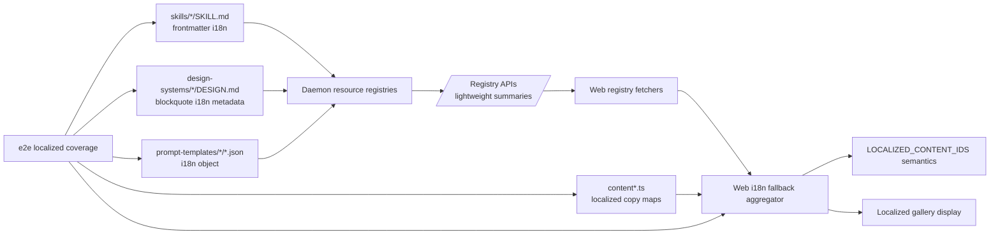

## Overview

### Problem Statement

- `content.ts`, `content.fr.ts`, and `content.ru.ts` maintain large centralized fallback ID arrays.
- Multiple PRs that add skills, design systems, or prompt templates all insert IDs into the same arrays.
- Git frequently creates conflicts when concurrent PRs edit nearby lines in those arrays.

### Goals

- Move i18n fallback declarations into each asset's own manifest or metadata.
- Let each asset declare fallback languages with a shape such as:
  ```json
  {
    "id": "dcf-valuation",
    "i18n": {
      "fallbackToEnglish": ["de", "fr", "ru"]
    }
  }
  ```
- Have the web runtime read all asset metadata and aggregate the previous fallback structure:
  ```json
  {
    "de": { "skills": [], "designSystems": [], "promptTemplates": [] },
    "fr": { "skills": [], "designSystems": [], "promptTemplates": [] },
    "ru": { "skills": [], "designSystems": [], "promptTemplates": [] }
  }
  ```
- Make `content.ts`, `content.fr.ts`, and `content.ru.ts` consume the aggregated fallback result.

### Scope

- Add asset self-declared i18n fallback metadata for skills, design systems, and prompt templates.
- Add runtime aggregation for fallback metadata.
- Remove hand-maintained fallback arrays from `content.ts`, `content.fr.ts`, and `content.ru.ts`.
- Keep coverage tests that require every asset to have localized copy or an explicit fallback declaration.

### Constraints

- Do not commit a generated registry file.
- Avoid moving merge conflicts from centralized content files into generated registry output.

### Success Criteria

- Adding a new asset PR only changes that asset's files for fallback declarations.
- Concurrent PRs that add different assets edit different files, reducing conflict probability.
- Existing fallback structure remains available at runtime through aggregation.
- Coverage tests fail when an asset has neither localized copy nor declared fallback.

## Research

### Existing System

- Web i18n display content is centralized in `apps/web/src/i18n/content.ts`; the bundle type stores localized copy plus three fallback ID arrays: `skillIdsWithEnFallback`, `designSystemIdsWithEnFallback`, and `promptTemplateIdsWithEnFallback`. Source: `apps/web/src/i18n/content.ts:40-49`
- German fallback arrays live in `content.ts` and include skills, design systems, and prompt templates. Source: `apps/web/src/i18n/content.ts:367-439,542-551`
- French and Russian content files export the same three fallback array families for their locale. Source: `apps/web/src/i18n/content.fr.ts:320-393,493-502`; `apps/web/src/i18n/content.ru.ts:320-393,493-502`
- `LOCALIZED_CONTENT` wires each locale to its localized copy maps and fallback arrays, then `buildLocalizedContentIds` merges copy keys with fallback IDs for coverage. Source: `apps/web/src/i18n/content.ts:1114-1174`
- Localized coverage is an e2e Vitest test that imports `LOCALIZED_CONTENT_IDS`, discovers skills, design systems, and prompt templates from resource directories, and expects every discovered resource ID to appear in localized IDs. Source: `e2e/tests/localized-content.test.ts:26-37,53-60,154-174`
- Skill IDs are discovered by scanning `skills/*/SKILL.md`; the test reads frontmatter `name` when present, then falls back to the directory name. Source: `e2e/tests/localized-content.test.ts:62-89,133-151`
- Design system IDs are discovered from `design-systems/*/DESIGN.md`; categories are parsed from a `> Category:` blockquote line. Source: `e2e/tests/localized-content.test.ts:91-104`
- Prompt template IDs, categories, and tags are discovered from `prompt-templates/{image,video}/*.json`. Source: `e2e/tests/localized-content.test.ts:107-130`
- Daemon skill registry parses `SKILL.md` frontmatter through `parseFrontmatter`, derives `id` from frontmatter `name` or folder name, and already normalizes several `od.*` metadata fields into `SkillInfo`. Source: `apps/daemon/src/skills.ts:29-34,94-171,441-453`
- Daemon design-system registry reads each `DESIGN.md`, derives `id` from folder name, title from H1, category from `> Category:`, summary from the first paragraph, surface from `> Surface:`, and swatches from markdown color tokens. Source: `apps/daemon/src/design-systems.ts:1-18,23-48,80-90,119-176`
- Daemon prompt-template registry reads `prompt-templates/{image,video}/*.json`, validates required JSON fields, and returns the parsed summary/detail shape. Source: `apps/daemon/src/prompt-templates.ts:1-8,36-70,89-130`
- Static resource routes expose `/api/skills`, `/api/design-systems`, and `/api/prompt-templates` by calling the daemon registries and stripping heavy bodies or prompts from listing payloads. Source: `apps/daemon/src/static-resource-routes.ts:46-68,148-176`
- Web registry fetchers consume these daemon endpoints for skills, design systems, and prompt templates. Source: `apps/web/src/providers/registry.ts:86-94,170-198`
- App contract DTOs define current `SkillSummary` and `DesignSystemSummary` fields shared by web and daemon. Source: `packages/contracts/src/api/registry.ts:25-83`
- Prompt template summary is currently typed in the web app with ID, surface, title, summary, category, tags, model/aspect, preview URLs, and source. Source: `apps/web/src/types.ts:377-399`
- Existing asset metadata formats are author-owned files: `SKILL.md` YAML frontmatter, `DESIGN.md` markdown metadata lines, and prompt-template JSON. Source: `skills/dcf-valuation/SKILL.md:1-26`; `design-systems/wechat/DESIGN.md:1-5`; `prompt-templates/image/social-media-post-showa-day-retro-culture-magazine-cover.json:1-22`

### Available Approaches

- **Option A: asset self-declared fallback metadata plus runtime aggregation**. The existing resource scanners already read the three asset families from their owner files, so i18n fallback declarations can travel through the same discovery paths before `LOCALIZED_CONTENT_IDS` is built. Source: `apps/daemon/src/skills.ts:94-171`; `apps/daemon/src/design-systems.ts:23-48`; `apps/daemon/src/prompt-templates.ts:36-70`; `apps/web/src/i18n/content.ts:1150-1174`
- **Option B: keep centralized arrays in locale content files**. Current implementation stores explicit fallback arrays per locale and per asset family in `content.ts`, `content.fr.ts`, and `content.ru.ts`. Source: `apps/web/src/i18n/content.ts:367-439,542-551`; `apps/web/src/i18n/content.fr.ts:320-393,493-502`; `apps/web/src/i18n/content.ru.ts:320-393,493-502`
- **Option C: generated fallback registry consumed by web**. The repository already has a generated-artifact pattern for artifact manifests, but the i18n coverage test currently computes coverage directly from source content and on-disk assets. Source: `apps/web/src/artifacts/manifest.ts:68-93,96-145`; `apps/web/tests/artifacts/manifest.test.ts:10-57,107-120`; `e2e/tests/localized-content.test.ts:154-174`

### Constraints & Dependencies

- `packages/contracts` is the shared web/daemon app contract layer and must stay pure TypeScript; web/daemon DTO changes belong there when API payload shapes change. Source: `packages/AGENTS.md:5-13`; `packages/contracts/src/api/registry.ts:25-83`
- App tests live under package/app-level `tests/`; cross-app/resource consistency checks belong in `e2e/tests/`. Source: `AGENTS.md:54-60`; `apps/AGENTS.md:27-32`; `e2e/AGENTS.md:19-38`
- Static resource route listing payloads intentionally omit heavy bodies and prompts, so fallback metadata used by the web runtime needs to be part of lightweight summaries or provided through another lightweight aggregation path. Source: `apps/daemon/src/static-resource-routes.ts:46-56,148-176`
- Some current code catches missing resource directories or malformed asset files and returns empty lists or skips entries. Any new validation path should keep required fallback metadata failures observable in coverage tests. Source: `apps/daemon/src/skills.ts:94-110`; `apps/daemon/src/design-systems.ts:23-51`; `apps/daemon/src/prompt-templates.ts:36-59`; `e2e/tests/localized-content.test.ts:53-60`
- Coverage currently validates the union of localized copy keys and fallback arrays, so changing fallback storage requires preserving `LOCALIZED_CONTENT_IDS` semantics or updating the test to consume the new aggregated fallback result. Source: `apps/web/src/i18n/content.ts:1150-1174`; `e2e/tests/localized-content.test.ts:154-174`

### Key References

- `apps/web/src/i18n/content.ts:40-49,367-439,542-551,1114-1174` - central localized content bundle, German fallback arrays, localized ID construction.
- `apps/web/src/i18n/content.fr.ts:320-393,493-502` - French fallback arrays.
- `apps/web/src/i18n/content.ru.ts:320-393,493-502` - Russian fallback arrays.
- `e2e/tests/localized-content.test.ts:26-37,53-60,62-130,154-174` - coverage test and asset discovery logic.
- `apps/daemon/src/skills.ts:29-34,94-171,441-453` - skill frontmatter parsing and summary construction.
- `apps/daemon/src/design-systems.ts:1-18,23-48,80-90` - design-system metadata parsing.
- `apps/daemon/src/prompt-templates.ts:1-8,36-70,89-130` - prompt-template JSON validation and summary construction.
- `apps/daemon/src/static-resource-routes.ts:46-68,148-176` - resource API payload boundaries.
- `packages/contracts/src/api/registry.ts:25-83` - shared skill and design-system DTOs.
- `apps/web/src/types.ts:377-399` - prompt-template DTO currently owned in web types.

## Design

### Architecture Overview



Recommended architecture: asset-declared metadata, daemon passthrough, web-owned aggregation, e2e-owned cross-resource coverage.

### Change Scope

- Area: asset metadata. Impact: add `i18n.fallbackToEnglish` to skills and prompt-template JSON; add equivalent i18n metadata to `DESIGN.md` using existing blockquote metadata style. Source: `skills/dcf-valuation/SKILL.md:1-26`; `design-systems/wechat/DESIGN.md:1-5`; `prompt-templates/image/social-media-post-showa-day-retro-culture-magazine-cover.json:1-22`
- Area: contracts. Impact: add shared `AssetI18nMetadata` and expose optional `i18n` on resource summary DTOs that cross web/daemon boundaries; move prompt-template summary/detail DTOs into contracts as part of the same API shape cleanup. Source: `packages/AGENTS.md:5-13`; `packages/contracts/src/api/registry.ts:25-83`; `apps/web/src/types.ts:377-399`
- Area: daemon registries. Impact: parse i18n metadata in existing skill, design-system, and prompt-template scanners, and include it in lightweight list payloads. Source: `apps/daemon/src/skills.ts:94-171`; `apps/daemon/src/design-systems.ts:23-48`; `apps/daemon/src/prompt-templates.ts:36-70`; `apps/daemon/src/static-resource-routes.ts:46-56,148-176`
- Area: web i18n. Impact: remove hand-authored fallback arrays from `content.ts`, `content.fr.ts`, and `content.ru.ts`; keep localized copy/category/tag maps; add a pure fallback aggregation helper consumed by localized ID construction and runtime display code. Source: `apps/web/src/i18n/content.ts:40-49,1114-1174`; `apps/web/src/i18n/content.fr.ts:320-393,493-502`; `apps/web/src/i18n/content.ru.ts:320-393,493-502`
- Area: coverage. Impact: update `e2e/tests/localized-content.test.ts` so every asset must have localized copy or asset-declared fallback for each supported resource-localization locale; keep category/tag coverage. Source: `e2e/tests/localized-content.test.ts:53-60,154-197`; `e2e/AGENTS.md:19-38`
- Area: generated artifacts. Impact: keep generated fallback registry out of scope. Source: `specs/change/20260511-asset-self-declared-i18n-fallback/spec.md:45-48`; `apps/web/src/artifacts/manifest.ts:68-93,96-145`

### Design Decisions

- Decision: fallback declaration belongs to the asset owner file, using the asset's existing metadata format. Skills use `SKILL.md` frontmatter, design systems use `DESIGN.md` metadata lines, prompt templates use JSON `i18n`. Source: `skills/dcf-valuation/SKILL.md:1-26`; `design-systems/wechat/DESIGN.md:1-5`; `prompt-templates/image/social-media-post-showa-day-retro-culture-magazine-cover.json:1-22`
- Decision: shared DTOs live in `packages/contracts`, including `AssetI18nMetadata` and prompt-template API DTOs. Source: `packages/AGENTS.md:5-13`; `packages/contracts/src/index.ts:1-28`; `packages/contracts/src/api/registry.ts:25-83`; `apps/web/src/types.ts:377-399`
- Decision: daemon registries parse and expose `i18n` as summary metadata; daemon aggregation stays limited to resource discovery. Source: `apps/daemon/src/skills.ts:94-171`; `apps/daemon/src/design-systems.ts:23-48`; `apps/daemon/src/prompt-templates.ts:36-70`; `apps/daemon/src/static-resource-routes.ts:46-56,148-176`
- Decision: web owns locale semantics and fallback aggregation because `Locale`, localized content bundles, and localized display behavior live in web i18n. Source: `apps/web/src/i18n/types.ts:1-5`; `apps/web/src/i18n/content.ts:40-49,1114-1174`
- Decision: `RESOURCE_FALLBACK_LOCALES = ['de', 'fr', 'ru']` should live next to the web i18n aggregation helper, typed as a subset of `Locale`. Source: `apps/web/src/i18n/types.ts:1-5`; `apps/web/src/i18n/content.ts:1170-1178`
- Decision: malformed `i18n.fallbackToEnglish` should fail validation in tests and fail parsing when the asset otherwise loads; coverage should catch missing or misspelled fallback locales. Source: `apps/daemon/src/skills.ts:211-213`; `apps/daemon/src/design-systems.ts:49-51`; `apps/daemon/src/prompt-templates.ts:57-59`; `e2e/tests/localized-content.test.ts:53-60`
- Decision: derived skill cards inherit the parent skill's i18n metadata because derived cards inherit the parent body and are generated from the same `SKILL.md`. Source: `apps/daemon/src/skills.ts:181-209`
- Decision: preserve `LOCALIZED_CONTENT_IDS` as the stable test/runtime abstraction, changing how fallback IDs are supplied. Source: `apps/web/src/i18n/content.ts:1150-1174`; `e2e/tests/localized-content.test.ts:26-37,154-174`

### Why this design

- It makes new asset PRs edit their own asset file for fallback declarations, reducing collisions in centralized locale files.
- It keeps API shape changes in the existing contracts boundary and keeps daemon responsibilities limited to resource discovery.
- It lets web i18n remain the owner of locale-specific display behavior while reusing daemon/resource metadata at runtime.
- It preserves the existing coverage guarantee: every curated resource has localized display copy or an explicit English fallback declaration.

### Test Strategy

- Contracts: typecheck `@open-design/contracts` after adding shared DTOs. Source: `packages/AGENTS.md:22-36`
- Daemon registries: add or update package tests for skill, design-system, and prompt-template i18n parsing, including valid metadata and malformed `fallbackToEnglish`. Source: `apps/AGENTS.md:27-32`; `apps/daemon/src/skills.ts:94-171`; `apps/daemon/src/design-systems.ts:23-48`; `apps/daemon/src/prompt-templates.ts:89-130`
- Web i18n: add or update `apps/web/tests/` coverage for the pure aggregation helper and `LOCALIZED_CONTENT_IDS` compatibility. Source: `apps/AGENTS.md:27-32`; `apps/web/src/i18n/content.ts:1150-1174`
- E2E: update `e2e/tests/localized-content.test.ts` to parse asset-level fallback declarations and assert localized copy or explicit fallback for skills, design systems, and prompt templates; keep category/tag checks. Source: `e2e/tests/localized-content.test.ts:62-130,154-197`; `e2e/AGENTS.md:19-38`
- Validation commands: run package-scoped checks for changed packages plus repo-level guard/typecheck. Source: `AGENTS.md:87-108`; `apps/AGENTS.md:47-59`; `packages/AGENTS.md:22-36`; `e2e/AGENTS.md:40-55`

### Pseudocode

```ts
type ResourceFallbackLocale = Extract<Locale, 'de' | 'fr' | 'ru'>;
type AssetI18nMetadata = { fallbackToEnglish?: ResourceFallbackLocale[] };

function aggregateFallbacks(resources) {
  const out = emptyFallbacks(['de', 'fr', 'ru']);
  for (const skill of resources.skills) add(out, 'skills', skill.id, skill.i18n);
  for (const system of resources.designSystems) add(out, 'designSystems', system.id, system.i18n);
  for (const template of resources.promptTemplates) add(out, 'promptTemplates', template.id, template.i18n);
  return sortFallbacks(out);
}

function buildLocalizedContentIds(content, fallbackIds) {
  return {
    skills: unique([...Object.keys(content.skillCopy), ...fallbackIds.skills]),
    designSystems: unique([...Object.keys(content.designSystemSummaries), ...fallbackIds.designSystems]),
    promptTemplates: unique([...Object.keys(content.promptTemplateCopy), ...fallbackIds.promptTemplates]),
    designSystemCategories: Object.keys(content.designSystemCategories),
    promptTemplateCategories: Object.keys(content.promptTemplateCategories),
    promptTemplateTags: Object.keys(content.promptTemplateTags),
  };
}
```

### File Structure

- `packages/contracts/src/api/registry.ts` - add `AssetI18nMetadata`, add optional `i18n`, add prompt-template API DTOs.
- `apps/daemon/src/skills.ts` - parse `i18n.fallbackToEnglish` from `SKILL.md` frontmatter and copy it to parent and derived summaries.
- `apps/daemon/src/design-systems.ts` - parse DESIGN.md i18n metadata line into summary `i18n`.
- `apps/daemon/src/prompt-templates.ts` - validate JSON `i18n.fallbackToEnglish` and expose it in summaries/details.
- `apps/web/src/i18n/content.ts` - remove hand-maintained fallback arrays and consume aggregated fallback IDs when building localized IDs.
- `apps/web/src/i18n/content.fr.ts` - remove exported fallback arrays.
- `apps/web/src/i18n/content.ru.ts` - remove exported fallback arrays.
- `apps/web/src/i18n/resourceFallbacks.ts` - new pure aggregation helper and resource fallback locale constants.
- `apps/web/tests/i18n/resourceFallbacks.test.ts` - aggregation and validation tests.
- `e2e/tests/localized-content.test.ts` - asset-level fallback coverage.

### Interfaces / APIs

```ts
export type AssetI18nFallbackLocale = 'de' | 'fr' | 'ru';

export interface AssetI18nMetadata {
  fallbackToEnglish?: AssetI18nFallbackLocale[];
}

export interface SkillSummary {
  i18n?: AssetI18nMetadata;
}

export interface DesignSystemSummary {
  i18n?: AssetI18nMetadata;
}

export interface PromptTemplateSummary {
  i18n?: AssetI18nMetadata;
}
```

Asset examples:

```yaml
# SKILL.md frontmatter
i18n:
  fallbackToEnglish:
    - de
    - fr
    - ru
```

```md
<!-- DESIGN.md metadata near Category/Surface -->
> I18n fallbackToEnglish: de, fr, ru
```

```json
{
  "id": "dcf-valuation",
  "i18n": { "fallbackToEnglish": ["de", "fr", "ru"] }
}
```

### Edge Cases

- Unknown locale in `fallbackToEnglish`: fail tests with the asset path and invalid locale.
- Duplicate locale in `fallbackToEnglish`: normalize to a unique sorted list and test the normalization.
- Asset has localized copy and fallback metadata for the same locale: allow it, with localized copy taking display precedence.
- Derived skill IDs: inherit parent i18n metadata for derived summaries.
- Missing optional metadata: coverage fails only when the asset also lacks localized copy for that locale.
- Malformed prompt-template JSON i18n: preserve existing template validation behavior while surfacing a clear warning/error in tests.

## Plan

- [ ] Step 1: Contracts and daemon metadata parsing
  - [ ] Substep 1.1 Implement: Add shared i18n and prompt-template DTOs in `packages/contracts`.
  - [ ] Substep 1.2 Implement: Parse and expose skill `i18n` metadata, including derived cards.
  - [ ] Substep 1.3 Implement: Parse and expose design-system i18n metadata.
  - [ ] Substep 1.4 Implement: Validate and expose prompt-template JSON i18n metadata.
  - [ ] Substep 1.5 Verify: Run contracts and daemon typechecks/tests covering valid and malformed metadata.
- [ ] Step 2: Web aggregation and content migration
  - [ ] Substep 2.1 Implement: Add the pure web fallback aggregation helper.
  - [ ] Substep 2.2 Implement: Wire localized ID construction to aggregated fallback IDs.
  - [ ] Substep 2.3 Implement: Remove centralized fallback arrays from `content.ts`, `content.fr.ts`, and `content.ru.ts`.
  - [ ] Substep 2.4 Verify: Add web tests for aggregation, dedupe, ordering, and localized copy precedence.
- [ ] Step 3: Asset migration and cross-resource coverage
  - [ ] Substep 3.1 Implement: Move existing fallback IDs into the corresponding asset metadata files.
  - [ ] Substep 3.2 Implement: Update e2e localized-content coverage to require localized copy or asset-declared fallback.
  - [ ] Substep 3.3 Verify: Run the localized-content e2e test file.
  - [ ] Substep 3.4 Verify: Run `pnpm guard`, `pnpm typecheck`, and changed package checks.

## Notes

<!-- Optional sections — add what's relevant. -->

### Implementation

<!-- Files created/modified, decisions made during coding, deviations from design -->

### Verification

<!-- How the feature was verified: tests written, manual testing steps, results -->
